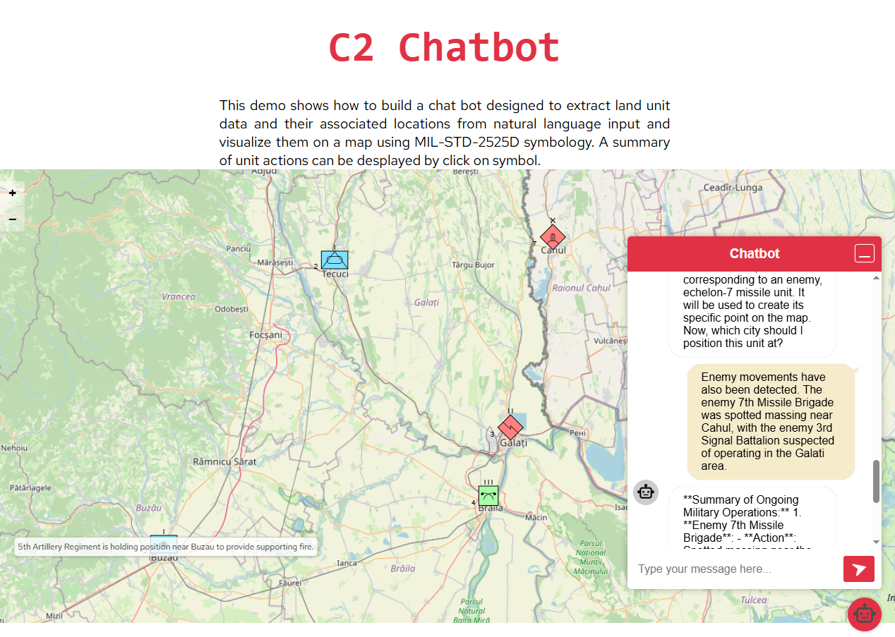

# c2_chatbot

  
  

This project is a proof-of-concept C2 chatbot designed to extract land units and their associated locations from natural language input. Once a unit is identified, the system derives its 30-character Symbol Identification Code (SIDC), extracts the unit’s unique designator, and generates a brief summary of its activities. If a location is mentioned, it is geocoded to obtain its latitude and longitude. All extracted data is visualized on a map using MIL-STD-2525D symbology and returned to the user in structured JSON format.

  

The application is built using the Quarkus Framework, leveraging its powerful extensions to support backend development. Integration with large language models (LLMs) is achieved through the Quarkus LangChain4j extension.

  

  

For mapping functionality, the project uses the excellent OpenLayers JavaScript library <https://openlayers.org/> The map is rendered using OpenStreetMap (OSM) as the base tile layer, offering a clean and open-source-friendly solution.

## 📄 Article: Exploring Generative AI in Military C2 Systems

This article explores practical applications of generative AI in military Command and Control systems.

🔗 [Download the PDF](./files/Exploring_Generative_AI_for_Military_C2_Systems.pdf)

Originally published on [LinkedIn](https://www.linkedin.com/pulse/exploring-generative-ai-military-c2-systems-practical-traian-nicula-idf0f)


A detailed description of the project can be found in this Linkedin article: **[Exploring Generative AI for Military C2 Systems: A Practical Approach](https://www.linkedin.com/pulse/exploring-generative-ai-military-c2-systems-practical-traian-nicula-idf0f)**

  

## Configutation

  

  

This project relies entirely on an Azure OpenAI-hosted language model’ In order to run this application in dev mode the proper configuration keys must be added:

  

- LLM Configuration:

```shell script

quarkus.langchain4j.azure-openai.api-key=<your-api-key>
quarkus.langchain4j.azure-openai.api-version=2024-08-01-preview
quarkus.langchain4j.azure-openai.resource-name=<resource-name>
quarkus.langchain4j.azure-openai.deployment-name=gpt-4o

```

  

For debugging

```shell script

quarkus.langchain4j.log-requests=true
quarkus.langchain4j.log-responses=true

```

  

- Geocoding URL

```shell script

quarkus.rest-client.geocoding.url=http://api.geonames.org

```

  

- Postgresql

  

Quarkus supports the automatic provisioning of unconfigured services in development and test model, using Testcontainers. In order to use most Dev Services with zero configuration you will need a working Docker container environment.
 
  

## Running the application in dev mode

You can run your application in dev mode that enables live coding using:
  

```shell script

./mvnw  quarkus:dev

```
 

## Using the project

Open your browser and navigate to <http://localhost:8080>. Zoomin the map to the area of interest. Click the red robot in the bottom right corner to open the chat window and input/copy a text referring military units and the locations as named places.
Here are some input samples:

> Our 2nd Armored Company is currently advancing toward Tecuci, while the 5th Artillery Regiment is holding its position near Buzau to provide supporting fire. 
> 
> Enemy movements have also been detected. The enemy 7th Missile Brigade was spotted massing near Cahul, with the enemy 3rd Signal Battalion suspected of operating in the Galati area.
> 
> On the neutral side, the neutral 4th CBRN Defense Regiment has been stationed in Braila, conducting stability operations.

With this inputs the map looks like in the image below:




### Known issues

If the input text refers to multiple units, the Standard Identity (e.g., friend, neutral, hostile) is extracted from the first unit and applied to the rest. For best results, it's recommended to input a batch of units that all belong to the same side.

Optimal performance is achieved when the input text includes only a single unit and its location.

Only entity types defined in MIL-STD-2525D (e.g., Infantry, Artillery, Armored) are supported. Letter case is not significant.
